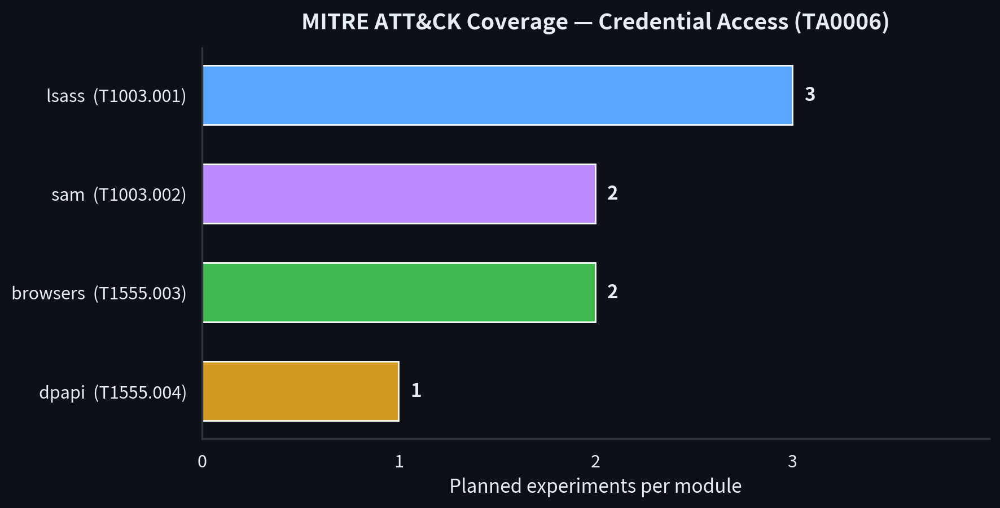
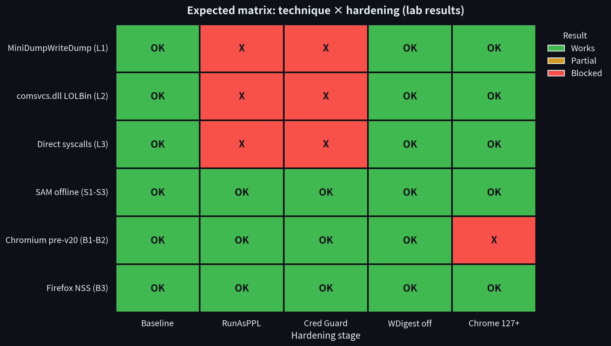
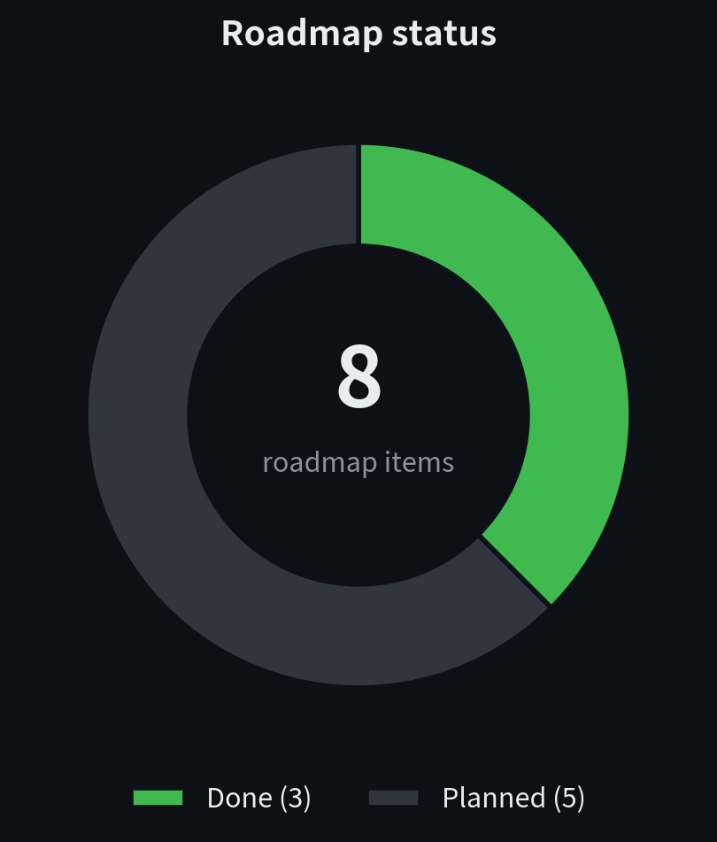

# cred-harvester


> **⚠️ Disclaimer**
> This repository is an **offensive security research** project intended exclusively for **isolated labs** and **authorized operations** (red team engagements with contractual scope and signed Rules of Engagement). Using any technique documented here against systems without explicit authorization is a crime (Brazil — Lei nº 12.737/2012; United States — CFAA; equivalent legislation in other jurisdictions). The author assumes no liability for misuse.

## Objective

A structured study of **Credential Access** techniques ([MITRE ATT&CK TA0006](https://attack.mitre.org/tactics/TA0006/)) on Windows environments, with research notes, lab PoCs, and documented experiments organized by module.

## Table of Contents

- [Project structure](#project-structure)
- [Modules](#modules)
- [Lab](#lab)
- [Roadmap](#roadmap)
- [References](#references)

## Project structure

```
cred-harvester/
├── docs/                    # Research notes per technique
│   ├── lsass-dumping.md     # T1003.001 — LSASS dump methods
│   ├── dpapi.md             # T1555.004 — DPAPI masterkeys and blobs
│   ├── browser-stores.md    # T1555.003 — browser credential stores
│   └── sam-offline.md       # T1003.002 — offline SAM/SYSTEM extraction
├── src/                     # Lab PoCs (see each module's README)
│   ├── lsass/
│   ├── dpapi/
│   ├── browsers/
│   └── sam/
├── lab/                     # Test environment setup and hardening
│   └── setup.md
├── CONTRIBUTING.md
└── LICENSE
```

## Modules

| Module | ATT&CK | Description | Status |
|---|---|---|---|
| [`lsass`](src/lsass/) | T1003.001 | Method comparison: `MiniDumpWriteDump`, `comsvcs.dll`, syscall-based handles | 📋 planned |
| [`dpapi`](src/dpapi/) | T1555.004 | Masterkey structure, decryption in user/machine context | 📋 planned |
| [`browsers`](src/browsers/) | T1555.003 | Login Data (Chromium, incl. App-Bound/v20), `logins.json` (Firefox) | 📋 planned |
| [`sam`](src/sam/) | T1003.002 | Offline parsing of SAM/SYSTEM/SECURITY hives | 📋 planned |

## Lab

All experiments run in an isolated environment. See **[lab/setup.md](lab/setup.md)** for the full guide:

- Windows 10/11 VM on a host-only network (or no NIC)
- Clean snapshots for rollback between experiments
- **Fictitious** credentials generated for testing only
- Hardening matrix (RunAsPPL, Credential Guard, App-Bound) applied in stages

## Roadmap

- [x] Repository scaffold + disclaimers
- [x] Research notes for all 4 modules
- [x] Lab setup guide
- [ ] PoC: LSASS dump via `MiniDumpWriteDump` (lab)
- [ ] PoC: offline SAM/SYSTEM parsing
- [ ] PoC: Chromium Login Data reading (pre-v20)
- [ ] Study: App-Bound Encryption (Chrome 127+)
- [ ] Results matrix: technique × hardening × telemetry

## Visualizations

<p align="center">
  
</p>

<p align="center">
  
</p>

<p align="center">
  
</p>

## References

- [MITRE ATT&CK — Credential Access (TA0006)](https://attack.mitre.org/tactics/TA0006/)
- [impacket](https://github.com/fortra/impacket) — `secretsdump.py` (offline parsing)
- [pypykatz](https://github.com/skelsec/pypykatz) — Python implementation of Mimikatz
- [SharpDPAPI](https://github.com/GhostPack/SharpDPAPI) / [DonPAPI](https://github.com/login-securite/DonPAPI)
- [Mimikatz](https://github.com/gentilkiwi/mimikatz) — Benjamin Delpy
- MS Learn — [DPAPI](https://learn.microsoft.com/en-us/dotnet/standard/security/how-to-use-data-protection), LSA Protection, Credential Guard

## License

MIT — see [LICENSE](LICENSE). The disclaimer above remains in effect regardless of the license.
